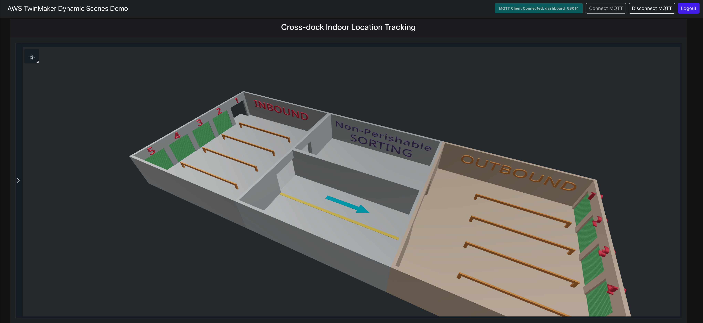
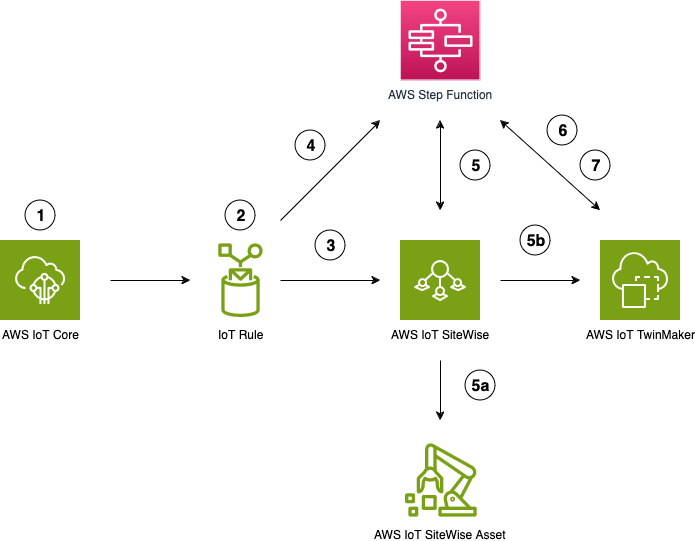
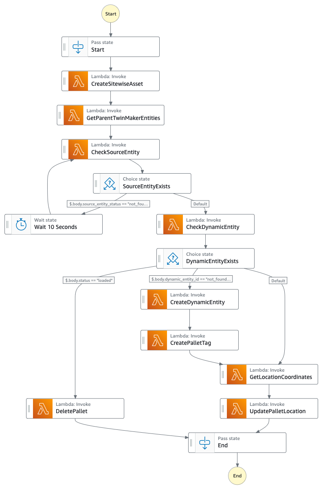

# AWS IoT TwinMaker - Dynamic Scenes Demo

AWS IoT TwinMaker makes it easier for developers to create digital twins of real-world systems such as buildings, factories, industrial equipment, and production lines. AWS IoT TwinMaker provides the tools you need to build digital twins to help you optimize building operations, increase production output, and improve equipment performance. With the ability to use existing data from multiple sources, create virtual representations of any physical environment, and combine existing 3D models with real-world data, you can now harness digital twins to create a holistic view of your operations faster and with less effort. 

The code in this repository creates all of the necessary resources in your AWS account and a base web application which simulates the operation of a cross-dock warehouse using AWS IoT TwinMaker, AWS IoT SiteWise, AWS IoT Core, AWS Step Functions and AWS Lambda.  

Using this demonstration code, the environment allows the simulation of goods on pallets entering the warehouse at the inbound docks, transition through sorting and then on to the outbound dock.  The web interface showing the digital twin visualisation of the warehouse is shown below;

The code in this respository demonstrates the operation and a potential use case for the Dynamic Scenes feature of AWS IoT TwinMaker and includes the following;

- [ ] AWS CDK (Cloud Development Kit) code to build the AWS resources required for the demo environment 
- [ ] A React web application to display the dynamic scene
- [ ] The 3D model files required to build the AWS IoT TwinMaker scene
- [ ] The AWS Lambda functions and AWS Step Function code containing the business logic for the dynamic scene

## Architecture

The architecture for this demo is shown below.  The AWS resources for this are created using CDK (Cloud Development Kit) with the instructions on how to do this on this page

1.	As pallets are scanned and their locations are updated, this data used to trigger the workflow.  In this example I am using a MQTT message, but this could also be a trigger based on updates in your WMS.
2.	An IoT Rule is activated based on the incoming message.  The IoT rule creates the seamless integration, with just a few clicks, into AWS IoT SiteWise and AWS Step Functions to then orchestrate the required updates.
3.	The IoT Rule send the data from the MQTT message to AWS IoT SiteWise.  At this point, if an AWS IoT SiteWise asset exists the message data will update the asset properties.  However, if a SiteWise asset does not exist, a SiteWise Data stream will be created that is un-assigned to an asset.
4.	The same IoT Rule also triggered the AWS Step Function to manage the orchestration workflow.
5.	The first thing that the AWS Step Function does is execute an AWS Lambda function to check with AWS IoT SiteWise whether an asset already exists (5a).  If an AWS IoT SiteWise asset does not exist then the AWS Lambda function creates one and associates the relevant unassigned data streams (from previous step) with the new asset.
6.	Entity Creation: Now that the AWS SiteWise asset definitely exists, the AWS Step Function executes another AWS Lambda function to simply check that the AWS IoT SiteWise asset has successfully synchronized with AWS IoT TwinMaker (5b) – confirming that the pallet (in our cross-dock scenario) exists as an AWS IoT TwinMaker Entity, and also creates a dynamic entity that contains the positional meta-data. 
7.	Position and Metadata Updates: Next the AWS Step Function (using another Lambda function) correlates the location in the message (step 1) to a location on the AWS TwinMaker Dynamic Scene.  In a real-world scenario this function can integrate with external sources, such as a WMS, to determine the position of the pallet in the scene.  The calculated scene coordinates are then used to update the relevant position meta-data of the pallet entity.  Your digital twin scene will reflect the near real-time movement and status of pallets within your cross-dock warehouse. This synchronized visualization provides an accurate, up-to-the-minute representation of your physical operations.

#### Step Function
The busines logic behind the movement of the pallets is managed by an AWS Step Function, with the diagram below showing the logic.  This can also be viewed in the AWS Step Functions section of the AWS console once the resources are built from CDK;

## Getting started

Firstly clone this repository to your local development environment.  

In order to build and run this demonstration environment you will need an AWS account and a user in that account with Administrator access.  The command line is used to carry out most actions, so you will need to install the AWS CLI (v2) and configure the CLI with your AWS user (using `aws configure` command)

The CDK and other build scripts are written in Python (3.12) so you will also need Python installed in your local development environment.

## Building the demo environment

### Create AWS Resources
Install the CDK and dependencies as per instructions in the link below;

https://docs.aws.amazon.com/cdk/v2/guide/work-with-cdk-python.html

`cdk bootstrap`

`cdk deploy`

Once the base resources are deployed, including the IoT TwinMaker workspace and scene, you will need to convert the IoT TwinMaker scene to a Dynamic Scene

- [ ] Open AWS Console, navigate to TwinMaker, open the Workspace “PalletMonitoring” and then the scene “pallet-scene”
- [ ] In the settings for the scene, select the checkbox to update the scene ‘every 30 seconds’ and then click the “Convert Scene” button

### Create TwinMaker Entities
Now that the IoT TwinMaker scene is configured as dynamic, you can add the entities for the scene.  In your CLI, navigate to the <repo>/cdk…/scripts folder and execute the create-entities Python script

`python3 create-entities.py`

### Configure the Web Application
Run the following Python script to configure the web application with the necessary parameters that point to the environment you just created.  You will need to define a username and password, and enter your email address in the parameters – this is used to create a Amazon Cognito user for you to access the React web application

`python3 build-config.py –region <my_region> --username <username> --password <password> --email <email_address>`

The above script also captures the necessary parameters from your AWS account resources to set the environment variables in the `react-web/src/aws-config.js` file, which are referenced by the React web application.

### Run the Web Application
Finally, you need to run the React web application to view the scene.  In your CLI, navigate to the react-web folder and then run the following commands;

`npm install`

`npm start`

A web browser should open with a logon screen (if not, navigate to http://localhost:3001 in your browser).  The username and password are those which you set are parameters when running the `build-config.py` Python script

## Cleanup

To avoid further costs of AWS resources when you have finished;

1. Run `cdk destroy` from the CLI to remove the CDK created resource
2. Follow the [instructions](https://docs.aws.amazon.com/AmazonS3/latest/userguide/empty-bucket.html) to empty all the S3 buckets that were deployed by this stack
3. You may need to delete the CloudFormation stack from the [CloudFormation console](https://console.aws.amazon.com/cloudformation) by following these [instructions](https://docs.aws.amazon.com/AWSCloudFormation/latest/UserGuide/cfn-console-delete-stack.html) if any resources fail to delete

## Authors and acknowledgment

Gary Emmerton

Extremely valuable guidance, assistance and contributions;
- Harry Wandersman
- Weston Harper 

## License

Refer to [LICENSE](LICENSE) file

## Contributing

See [CONTRIBUTING](CONTRIBUTING) file

